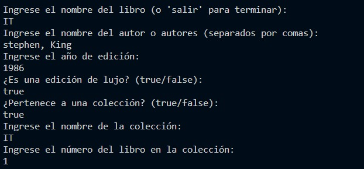

## Caso herencia 2:
Se necesita escribir las clases necesarias y una aplicación para registrar la información de los libros pertenecientes a la biblioteca del señor Pérez. El ha informado que de cada libro desea guardar el nombre del mismo, el nombre del autor o autores, el año de edición y si se trata de una edición de lujo o no. También ha dicho que tiene una serie de libros que forman colecciones, en cuyo caso además de lo anterior, requiere guardar el nombre de la colección y el número que ocupa el libro en la colección. La única aclaración adicional es que si se trata de un libro con mas de dos autores quiere guardar el primer autor, y el nombre del segundo debe aparecer "y otros".

Cree una clase ejecutable a partir de la cual pueda hacer pruebas mediante la consola. 2. Usando el patrón MVC, implemente una app que permita crear y gestionar libros de la biblioteca del Sr. Pérez.

# evidencia punto 1:
